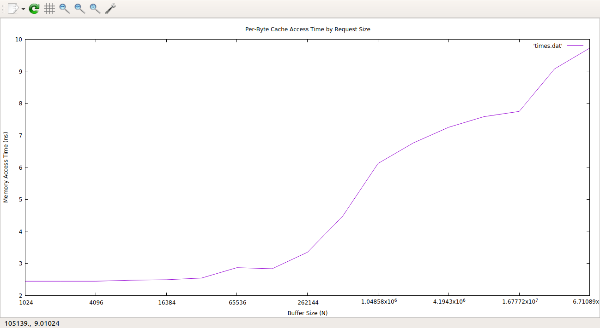

# HW1: Benchmarking the memory hierarchy
Ian Jackson

Goal: Determine sizes of different cache layers by measuring memory performance for different request sizes.

# Part One: Benchmarking
  - Benchmarking was done by creating a buffer (a vector of integers) of varying size (2^10 <= N <= 2^26 and timing N-number of single-byte copies.
  - I was able to account for sub-nanosecond memory accesses by accessing multiple int reads and dividing by sizeof(int).
  - I was also able to account for latency variance (due to OS and VM) by measuring N reads, 10 times for each buffer size, and then take the minimum (or most efficient) time
  - I tricked the prefetcher by randomly shuffling indices to choose from the buffer so as to access byte unpredictably. I also printed out some of the accessed buffer reqds in order to prevent the prefetcher from ignoring the operation due to not using the copied value.

# Part Two: Graphing

- The graph acess_times.png was made using gnuplot, after saving the output from main to a file (times.dat).

# Part Three: Analysis
-  I imagine that the latency of a memory access is slightly uniform within a single cache until the request is too large and overflows to the next level, at which point the latency increases. From looking at the graph, then, it would seem that the max L1 cache size is around 1100 KB, as the latency doubles around that point, stabilizing slightly before jumping again around 16000 KB. These ranges, I can infer, are roughly the capacities of the L1, L2, and L3 caches.
- I did not get quite the same performance as the table provided in the assignment, at least for L1. For L2, the access time seems to be roughly similar to the table (around 7 ns). The reasoning for this incongruence for L1 timing is in the next section.
- According to the /proc/cpuinfo file, the machine's cache size is 3072 KB. This is not quite what is exemplified by the plot, which could be due to a number of factors, outlined in the section below.

### Latency not ideal, but a pleasant visualization! 
- The hardware prefetcher could still be finding some predictability in the code, thus causing some L1 caching to contaminate the actual runtime that we're looking at. 
- Another contributing factor could be the fact that I used standard template vectors rather than arrays, the accessing of which could have resulted in inflated latency.
- Still was able to find a stepwise plot of memory access times based on varying request sizes! :-)
